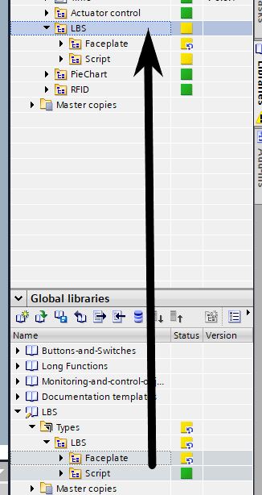
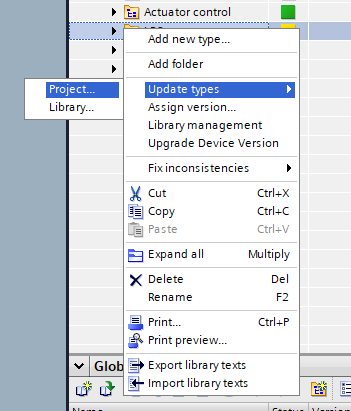

# How to Update

Follow the steps below to update the content:

1. **Prepare the Folders:** Ensure that both the existing and new content folders are named "LBS" (with capital letters). If not, rename them accordingly.

2. **Drag the New Content:** Drag the new content into the already created "LBS" folder. This will combine the existing content with the updates.

3. **Update the Project Folder:** Perform a complete update of the whole project folder. This action ensures that all previously used faceplates or scripts are properly updated to the newest version.

